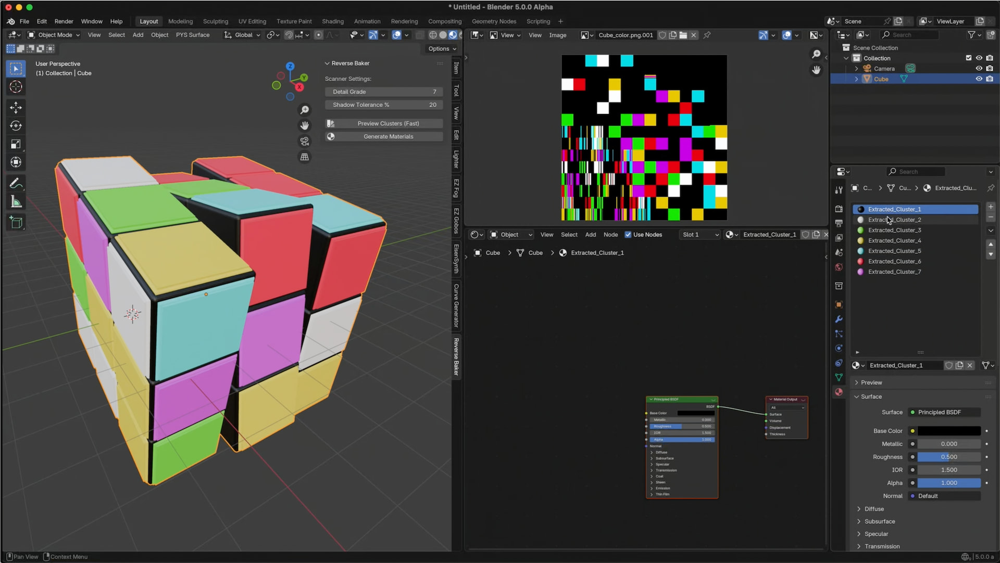

# Reverse Baking
The Reverse Baker is a technical art tool that reverses the standard texture baking pipeline. Instead of baking materials into a single image texture, it scans an existing baked image (like an albedo or diffuse map), intelligently identifies the dominant base colors while ignoring baked-in shadows and highlights, and rebuilds them into discrete, editable Principled BSDF materials assigned precisely to the mesh geometry.

# Screen Shot

## The Why
The idea behind this add-on was to create the possibility of reactivating the original material properties from a baked material texture, or at least in the form of an approximation of the original definition of the original material.

## Installation
1. Download the latest release from the [Releases page](https://github.com/smice-art/Reverse-Baking/releases).
2. In Blender, go to **Edit > Preferences > Get Extensions**.
3. Click the dropdown in the top right and select **Install from Disk**.
4. Select your `.zip` file.

## Quick Start
* **Preparation**: Ensure your mesh has an active material with an Image Texture node.
* **Access**: Press 'N' in the 3D Viewport and navigate to the **Reverse Baker** tab.
* **Parameters**: Adjust the cluster settings to define how many unique materials to extract.
* **Generate**: Click "Generate Materials" to rebuild your node network.

## Documentation
Download the full technical guide here: [Documentation (PDF)](docs/Reverse%20Baker%20Blender%20Add.pdf)

## Video Tutorial
This short video tutorial on YouTube is explaining the basic function.

